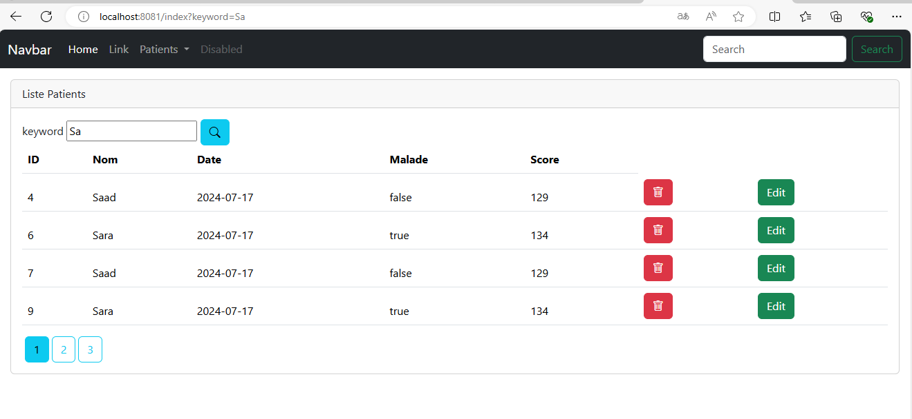
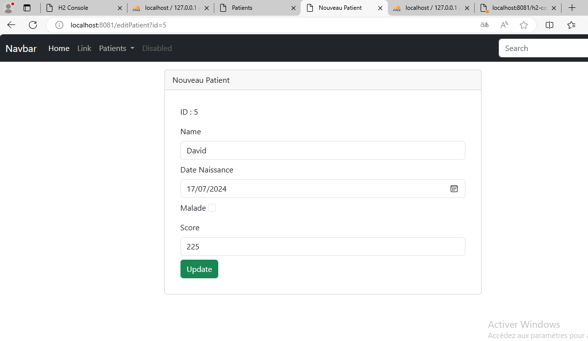

<h2>Spring MVC Thymeleaf Spring Security</h2>
<h3>H2 Database</h3> 

<h3>MySql Database</h3>

<h3>Afficher les patients</h3>

<h3>Faire la pagination</h3>

<h3>Chercher les patients</h3>

<h3>Supprimer un patient</h3>

<h3>Ajouter un patient un patient</h3>

<h3>Modifier un patient un patient</h3>

<h3>Sécurité avec Spring securitY</h3>

